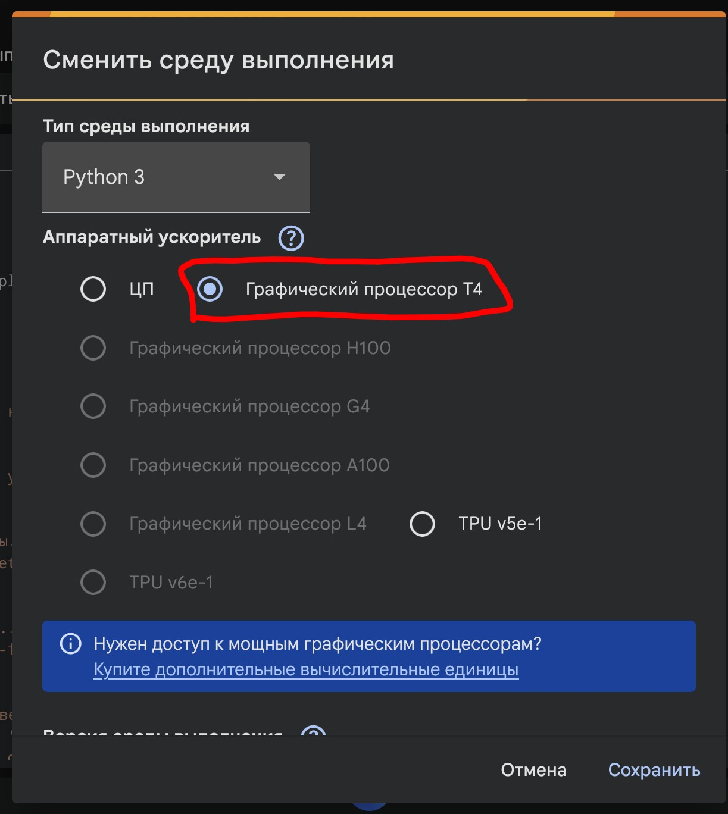

# 🤖 PicoClaw Telegram Bot

<div align="center">

[](https://colab.research.google.com/github/Anorwed/vkr/blob/main/picoclawcolabqwen.ipynb)
[](https://python.org)
[](https://ollama.com)
[](LICENSE)

**Личный AI-ассистент в Telegram на базе Qwen 2.5**

[🚀 Быстрый старт](#-быстрая-установка) • [📱 Android/Termux](#-версия-для-android) • [☁️ Google Colab](#-версия-для-google-colab) • [⚙️ Настройка](#-конфигурация)

</div>

---

## ✨ Возможности

- 🛠️ **Выполнение команд** — бот может запускать shell-команды, работать с файлами
- 💻 **Написание кода** — генерация и редактирование кода на Python, JS и др.
- 📁 **Работа с файлами** — создание, чтение, редактирование документов
- 🔒 **Безопасность** — изолированное окружение, ограничение рабочей папки
- 🌐 **Доступ из любой точки** — работает на Android, Colab или VPS

> **Модель:** Qwen 2.5 7B (поддерживает function calling, работает стабильно)

---

## 🚀 Быстрая установка

### ☁️ Версия для Google Colab (Рекомендуется)

> **Самый простой способ** — не требует установки, работает в облаке

[](https://colab.research.google.com/github/Anorwed/vkr/blob/main/picoclawcolabqwen.ipynb)

1. Нажмите кнопку **"Open in Colab"** выше ↑
2. Войдите в Google-аккаунт
3. Получите токен бота у [@BotFather](https://t.me/BotFather)
4. 
5. 
6. 
7. 
8. Готово! Бот отвечает в Telegram

> ⚠️ **Важно**: Сессия Colab активна ~12 часов. Для постоянной работы используйте Android-версию.

---

### 📱 Версия для Android (Termux)

Разверните личного AI-ассистента на любом Android-устройстве с интерфейсом для Gemini 2.5 Flash (или другой модели).

#### Требования
- Android 7.0+
- 2 GB свободной памяти
- Стабильное интернет-соединение

#### 🔧 Подготовка

‼️ **Пользователям в РФ**: Рекомендуется включить VPN перед началом.

1. **Установите Termux** — [скачать APK](https://github.com/termux/termux-app/releases/download/v0.118.3/termux-app_v0.118.3+github-debug_universal.apk)
2. **Создайте бота в Telegram** — напишите [@BotFather](https://t.me/BotFather), получите токен
3. **Получите API-ключ Gemini** — [aistudio.google.com/api-keys](https://aistudio.google.com/api-keys)

#### 📥 Установка (одной командой)

Откройте Termux, вставьте команду и нажмите **Enter**:

```bash
pkg install wget -y && wget -O setupbot.sh https://raw.githubusercontent.com/Anorwed/vkr/main/setupbot.sh && chmod +x setupbot.sh && ./setupbot.sh
```

> 💡 Совет: Долгий тап в Termux = вставка из буфера обмена

🔄 Перезапуск бота

Если закрыли Termux или нужно перезапустить:

```bash
proot-distro login debian -- bash -c "cd /root/chemistry_bot && source venv/bin/activate && python3 main.py"
```

⏹️ Остановка бота

Нажмите `Ctrl + C` в окне Termux.

---

⚙️ Конфигурация

Смена модели AI

Отредактируйте `core/ai.py`:

```python
# Для Gemini (по умолчанию)
model = "gemini-2.5-flash"

# Для других моделей OpenRouter
model = "anthropic/claude-3.5-sonnet"
model = "openai/gpt-4o-mini"
```

Настройка Telegram

Измените токен в `.env` файле:

```bash
BOT_TOKEN=your_token_here
```

---

🎓 Обучение

Нужен совет, как правильно пользоваться нейросетями?

[](https://edu.kpfu.ru/course/section.php?id=76191)

[Перейти на курс КФУ →](https://edu.kpfu.ru/course/section.php?id=76191)

---

🛠️ Техническая поддержка

Проблема	Решение	
Бот не отвечает	Проверьте токен в @BotFather	
Ошибка 400	Проверьте VPN и интернет	
Colab отключается	Используйте Android-версию	

Issues: [Создать тикет](https://github.com/Anorwed/vkr/issues)

---

[⬆ Наверх](#-picoclaw-telegram-bot)

Made with ❤️ for educational purposes
